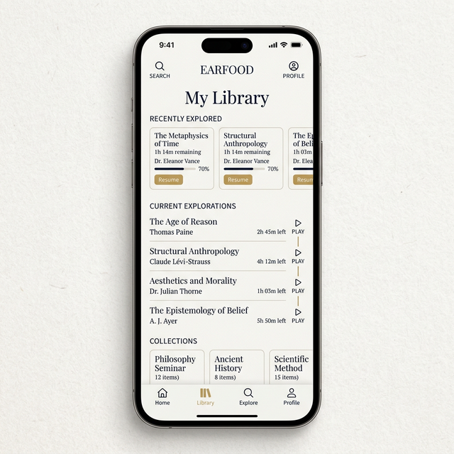

# EarFood — Lecteur Audio IA pour Documents

> **Version** : 0.1.0
> **Date** : 2026-03-03
> **Description** : Version de type `Y.X.Z`
> - `Y` : Version Majeure (décidée par l'utilisateur)
> - `X` : Versions Mineures (incrémentées à chaque nouvelle fonctionnalité)
> - `Z` : Versions Micro (incrémentées à chaque correction de bug)
> **Objectif** : Transformer vos documents en audiobooks avec IA, surlignage, notes, et résumés intelligents.

---

## 📋 Vision

EarFood est une PWA qui transforme vos documents PDF, ebooks, et Word en expériences de lecture audio enrichies. L'IA synthétise les contenus, gère la progression, et vous permet de capturer les passages importants avec des marque-pages et du surlignage.

**Cas d'usage** :
- Apprendre à votre rythme (0.5x → 2x vitesse)
- Lire en voiture, en courant, en cuisine (mains libres)
- Extraire les idées clés d'un document
- Revenir où vous étiez en un clic

---

## 🎯 Fonctionnalités Principales

### Phase 1 : MVP (Lecture + Progression)

#### 1. **Gestion de Bibliothèque**
- ✅ Import local de documents (PDF, EPUB, DOCX)
- ✅ Liste visuelle des documents avec thumbnail/cover
- ✅ Affichage : titre, auteur, durée estimée, % progression
- ✅ Suppression de documents
- ✅ Stockage : **IndexedDB** (localStorage + localForage)

#### 2. **Lecteur Audio**
- ✅ Synthèse vocale (Web Speech API ou Cloudflare AI)
- ✅ Contrôles : Play/Pause, ⏪ -15s, ⏩ +15s
- ✅ Vitesse : slider 0.5x → 2x (pas de 0.25x)
- ✅ Barre de progression (draggable)
- ✅ Affichage du temps : `HH:MM:SS / TOTAL`
- ✅ Sauvegarde de la position au pause/arrêt

#### 3. **Progression & Persistance**
- ✅ Enregistrement position actuelle pour chaque document
- ✅ Reprendre automatiquement à la dernière position
- ✅ **Reprise Intelligente** :
    - En pause/reprise : Reprise au point exact.
    - Après redémarrage de l'app : Reprise au **début de la phrase** où la lecture s'est arrêtée.
- ✅ % de progression visuel
- ✅ Horodatage : dernière lecture, durée totale écoutée

#### 4. **Lecture Synchronisée (Text Seguance)** ⭐
- ✅ Affichage du texte en cours de lecture dans la vue lecteur.
- ✅ **Surlignage dynamique** de la phrase ou du paragraphe en cours.
- ✅ Défilement automatique pour garder le texte lu au centre de l'écran.

#### 5. **Marque-Pages**
- ✅ Créer un marque-page à la position actuelle
- ✅ Liste des marque-pages avec position + titre personnalisé
- ✅ Sauter à un marque-page
- ✅ Supprimer un marque-page

#### 6. **Surlignage Tactile** ⭐
- ✅ Interface de surlignage : sélectionner du texte au doigt
- ✅ Enregistrement : `[position_début, position_fin, couleur, timestamp]`
- ✅ Affichage visuel du surlignage dans la vue texte
- ✅ Gestion des multiples passages surlignés
- ✅ Suppression d'un surlignage

#### 7. **Export Markdown** 📄
- ✅ Bouton "Exporter les passages surlignés"
- ✅ Format :
  ```markdown
  # Document : [Titre]
  ## Passages surlignés

  **Passage 1** (position: 2:34)
  > Texte du passage surlignéé...

  **Passage 2** (position: 5:12)
  > Autre passage...
  ```
- ✅ Download `.md` ou copier clipboard

---

### Phase 2 : Résumés Intelligents

#### 8. **Résumé Audio Contextuel** 🧠
- [ ] Détection de début de chapitre
- [ ] API : résumé via **Gemini 1.5 Flash** (rapide et efficace)
- [ ] Synthèse vocale : 30s max
- [ ] Lecture auto du résumé ou manuelle
- [ ] Stockage local du résumé (cache)

### Phase 3 : Interaction & Modes Alternatifs

#### 9. **Dialogue avec le Doc (Contextual Chat)** 💬
- [ ] Interface de chat dédiée (tiroir ou modal)
- [ ] **Design "Modern Scholarly"** : Moins austère, utilisant des bulles de chat élégantes et des micro-animations.
- [ ] **Entrée Hybride** : Saisie clavier ou dictée vocale (Speech-to-Text)
- [ ] **RAG (Retrieval Augmented Generation)** : L'IA répond en utilisant le contenu du document comme contexte
- [ ] **Réponse Vocale** : L'IA peut lire sa réponse à haute voix
- [ ] Historique des échanges sauvegardé par document

#### 10. **Modes de Traitement (Privacy & Offline)** 🛡️
- [ ] **Mode Hybride (Default)** :
    - Utilise **Edge TTS (Neural)** pour une qualité premium gratuite.
    - Système de **Fallback automatique** : si Edge TTS est indisponible, bascule sur la Web Speech API locale.
- [ ] **Mode Local-Only** : 
    - Tout reste dans le navigateur.
    - Utilise exclusivement la Web Speech API pour la voix.
    - Pas d'envoi de contenu à des serveurs tiers.
- [ ] **Mode Cloud-Enhanced** :
    - Utilisation des APIs (Cloudflare, OpenAI) pour des résumés haute fidélité.
    - Nécessite une clé API ou un abonnement.
- [ ] Switch rapide entre les modes dans les réglages.

#### 11. **Réglages & Version** ⚙️
- [ ] Affichage du numéro de version en bas des réglages.
- [ ] Boutons de gestion du cache.
- [ ] Icône de l'application (Logo EarFood).

---

## 🏗️ Architecture Technique

### Stack Frontend
```
├── Vite + React 19
├── localForage (IndexedDB)
├── Web Speech API (synthèse vocale)
│   ou Cloudflare AI (Workers)
├── Styles inline + CSS variables
└── PWA (workbox + manifest)
```

### Stockage Local (IndexedDB)

```js
// Base : "EarFood"
// Stores :

"documents" : {
  // key: documentId (UUID)
  id: "uuid",
  title: string,
  author: string,
  filename: string,
  type: "pdf" | "epub" | "docx",
  content: string, // texte brut extrait
  duration: number, // secondes (estimée)
  createdAt: timestamp,
  updatedAt: timestamp,
  size: number, // bytes
  cover: blob, // thumbnail
}

"progress" : {
  // key: documentId
  documentId: string,
  currentPosition: number, // en secondes
  percentage: number,
  lastReadAt: timestamp,
  totalTimeListened: number, // en sec
}

"bookmarks" : [
  {
    id: uuid,
    documentId: string,
    position: number, // en sec
    title: string, // custom
    createdAt: timestamp,
  }
]

"highlights" : [
  {
    id: uuid,
    documentId: string,
    startPos: number, // en car
    endPos: number,
    text: string,
    color: string, // hex
    createdAt: timestamp,
  }
]

"summaries" : {
  // key: documentId_chapterStart
  documentId: string,
  chapterStart: number, // position
  summary: string, // text
  audioUrl: string, // data-uri ou url
  duration: number,
  createdAt: timestamp,
}
```

---

## 🎨 Design & UX

### Écrans Principaux

#### 1️⃣ **Accueil / Bibliothèque**
```
┌─────────────────────────┐
│  EarFood  [+Import]     │
├─────────────────────────┤
│ 🎓 Python Avancé        │ ← Card
│   John Doe | 4h 32m     │
│   ████████░░ 67%        │
│   Reprise dans 23m      │
│                         │
│ 📖 Clean Code           │
│   Robert Martin | 6h    │
│   ██░░░░░░░░ 15%        │
│   Démarrer la lecture    │
│                         │
│ 📚 [+] Ajouter doc      │
└─────────────────────────┘
```

#### 2️⃣ **Lecteur**
```
┌──────────────────────────┐
│  ← Python Avancé         │
├──────────────────────────┤
│                          │
│   [Texte du chapitre     │
│    dans la view texte]   │
│                          │
├──────────────────────────┤
│  ⏪ -15s  [▶ Pause] ⏩ +15s │
│  ════════●════════ 2:34  │
│  0.5x ←[●]→ 2x           │
├──────────────────────────┤
│ 📍 Marque-page  💛 Export │
│ ✏️ Surligner             │
└──────────────────────────┘
```

#### 3️⃣ **Export / Passages Surlignés**
```
┌─────────────────────────┐
│  Python Avancé — Exports │
├─────────────────────────┤
│ 📋 4 passages surlignés  │
│                         │
│ ① Passage 1 (2:34)     │
│   > Texte du passage    │
│                         │
│ ② Passage 2 (5:12)     │
│   > Autre texte        │
│                         │
│ [Copier] [Télécharger] │
└─────────────────────────┘
```

### Palette Couleurs
```css
--color-primary    : #6366f1 (indigo)
--color-success    : #10b981 (émeraude)
--color-warning    : #f59e0b (orange)
--color-highlight-1: #fef08a (jaune clair) ← default
--color-highlight-2: #fca5a5 (rose)
--color-highlight-3: #a7f3d0 (vert menthe)
--bg-paper          : #fdfaf6 (crème texturé)
--accent-gold       : #c5a059 (or mat)
--accent-navy       : #1a2b3c (bleu académique)

### 🏢 Branding & Icônes

**Concept pour l'icône EarFood** :
- **Forme** : Un livre ouvert dont les pages se transforment en ondes sonores fluides.
- **Couleur** : Dégradé de bleu marine académique vers un doré sourd.
- **Style** : Minimaliste, lignes fines, fond "papier" (crème).
- **Usages** : Favicon, Icône PWA (512x512), Splash screen.


---

## 🖼️ Design Charter (Visuals)


*Bibliothèque : Focus sur la typographie et le négatif space.*


*Lecteur : Affichage du texte synchrone avec réglages fins.*


*Chat : Dialogue structuré et élégant avec l'IA.*

---

## 🔧 Roadmap

### Sprint 1 : MVP Lecture
- [ ] Setup Vite + React + localForage
- [ ] Composant d'import documents
- [ ] Lecteur audio basic (Web Speech)
- [ ] Progression & persistance

### Sprint 2 : Interactions
- [ ] Marque-pages
- [ ] Surlignage tactile + visualisation
- [ ] Export Markdown

### Sprint 3 : Surlignage UX Polish
- [ ] Palette de couleurs surlignage
- [ ] Annotation rapide (titre passage)
- [ ] Recherche dans surlignages

### Sprint 4 : Résumés & IA
- [ ] Intégration Gemini API (Google AI SDK)
- [ ] Résumé contextualisé par chapitre (Gemini 1.5 Flash)
- [ ] Synthèse vocale audio des résumés

### Sprint 5 : Polish
- [ ] Dark mode
- [ ] Offline support (SW)
- [ ] Export PDF (highlights visuels)
- [ ] Analytics (pages/jour, temps écoute)

### Sprint 6 : Dialogue & Privacy
- [ ] Implémentation du système de chat (UI)
- [ ] Intégration Speech-to-Text pour la dictée
- [ ] Logique de switch Local vs Cloud
- [ ] Premier test de RAG basique sur le texte extrait

---

## 🚀 Notes de Développement

- **Pas de TypeScript** pour rester rapide (comme ProverbSeed)
- **Styles inline** avec CSS variables pour theme/dark mode
- **API synthèse vocale** : Stratégie multicouche :
    1. Edge TTS (via WebSocket) pour la qualité Neural gratuite.
    2. Web Speech API (Local) en repli (Fallback) pour le mode offline/privé.
    3. Gemini API (Multimodal) pour les résumés audio et le chat.

- **PDF/EPUB** : utiliser `pdf.js`, `epubjs` pour extraction de texte
- **DOCX** : `mammoth.js` pour extraction texte propre
- **PWA** : workbox + service worker pour offline lecture
- **Monitoring** : logs temps de traitement documents volumineux

---

## 📦 Dépendances Potentielles

```json
{
  "react": "^19.0.0",
  "vite": "^5.0.0",
  "localforage": "^1.10.0",
  "pdf.js": "^latest",
  "epubjs": "^latest",
  "mammoth": "^latest",
  "workbox-*": "^6.0.0",
  "pdfkit": "^optional (export PDF with highlights)"
}
```

---

## 🤔 Questions Ouvertes

1. **Source IA pour résumés** : OpenAI API, Cloudflare AI, ou local?
2. **Synthèse vocale** : Web Speech (limité), ElevenLabs, Google Cloud?
3. **Extraction DOCX** : ordre les chapitres automatiquement?
4. **Offline** : documents téléchargés d'avance ou streaming audio?
5. **Privacy** : tout local ou peut-on envoyer contenu à IA?

---

## ✅ Checklist Prochaine Étape

- [ ] Affiner les réponses aux questions ouvertes
- [ ] Créer structure de dossiers
- [ ] Setup Vite + React initial
- [ ] Créer composant d'import documents (mock)
- [ ] Valider l'architecture IndexedDB

---

*Prêt à itérer ! Retours et ajustements bienvenus.*
